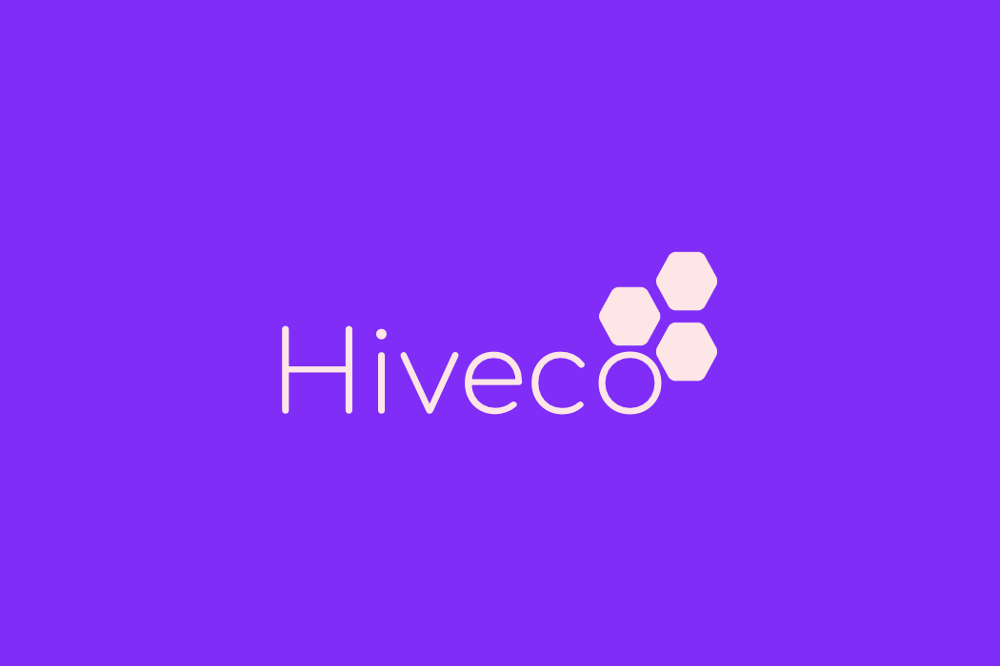

# Refactoring 3 - Tell, Don't Ask

## Hiveco

Hiveco is a company that provides flexible coworking space for businesses, creatives, freelancers and students. 
They are a growing business and have expanded to multiple locations. Each location has a limited number of meeting
rooms that can be booked by members one week in advance. However, meeting rooms are in high demand, small businesses at 
Hiveco like to book regular times for their ceremonies each week and students frequently request ad hoc meetings for 
their group projects. 

To ensure that meeting rooms are used fairly, Hiveco have introduced a paid priority booking service that members can
subscribe to. Each week an admin processes all the priority bookings for the next week and then processes standard
booking requests on a first come, first served basis. However, as Hiveco continue to grow, so does the administration
required to process meeting room booking requests. To solve this growing admin issue they have introduced an 
automated system that will run each week to process booking requests, allowing admins to spend more time servicing their
members.

Sometimes priority bookings can't be processed, either because the member hasn't paid their subscription fee or because
the requested room isn't available. Members who haven't paid their subscription fee will receive an email notifying them
that they are required to pay, and their request will be converted to a standard booking request. In the case that the requested room is already booked then an alternative room which
is available at the requested time will be offered. However, if no other rooms are available at the requested time then
an email will be sent to notify the member that the booking was not processed.

## Questions

- Where can you smell `Feature Envy`?
- Where can you see `Tell, Don't Ask` being violated?
- Where could you apply `Fail Fast`?
- Do you have any thoughts on the design of `Clock`?
- How could you improve the design of the tests?
